## Docker Deployment to Azure Container Service (Kubernetes - AKS) using VSTS for ASP.NETCORE application

## Overview

This lab shows how to build custom images of <a href="http://dockr.ly/2zLiDPy">**Dockerized ASP.NETCORE**</a> web application, push those images to <a href="http://dockr.ly/2AJLgge"> **Private Repository** </a> (<a href="http://bit.ly/2jssVQy"> Azure Container Registry </a>), and pull these images to deploy in **Azure Container Service (AKS)** using Visual Studio Team Services.

<a href="https://azure.microsoft.com/en-us/services/container-service/">**Azure Container Service (AKS)**</a> is the quickest path from zero to Kubernetes on Azure. This new service features an Azure-hosted control plane, automated upgrades, self-healing, easy scaling, and a simple user experience for both developers and cluster operators. With AKS, customers get the benefits of open source Kubernetes without complexity and operational overhead. Combination of Team Services and Azure integration with Docker will enable you to:

1.  <a href="http://dockr.ly/2z2Qsi2"> Build </a> your own custom images using <a href="http://bit.ly/2jqGujv"> VSTS Hosted Linux agent </a>
2. <a href="http://dockr.ly/2hAZco0"> Push </a> and store images in your private repository
3. Deploy and  <a href="http://dockr.ly/2AJPaEW"> run </a> images in Kubernetes setup

Below screenshot helps you understand the VSTS DevOps workflow with Docker: 

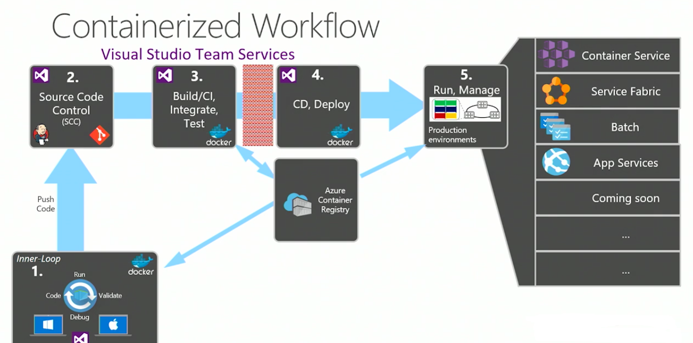

## Pre-requisites

1.  **Microsoft Azure Account**: You need a valid and active azure account for the labs.

2. You need a **Visual Studio Team Services Account** and <a href="http://bit.ly/2gBL4r4">Personal Access Token</a>.

    

3. You need to install **Docker Integration** extension from <a href="http://bit.ly/2hurgK3">Visual Studio Marketplace</a>.

## Setting up the Environment

We will create an **Azure Container Registry** to store the images generated during VSTS build. These images contain environment configuration details with build settings.  An **AKS** is created where custom built images will be deployed to run inside containers. A **SQL Database** is created as the backend.   

1. Click on **Deploy to Azure** to spin up **Azure Container Registry**, **AKS** and **SQL Database** (Note: This ARM Template is not yet complete).

    

   
2. It takes approximately **3 to 4 minutes** to provision the environment. 

   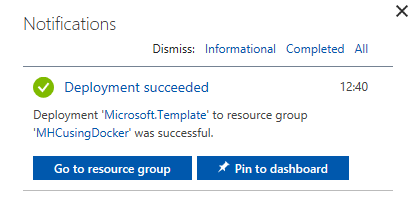

3. Below components are created post deployment. Click on **Azure Container Registry**.

      
    <table width="100%">
     <thead>
      <tr>
         <th width="50%"><b>Azure Components</b></th>
         <th><b>Description</b></th>
      </tr>
    </thead>
    <tr>
      <td><a href="http://bit.ly/2mwVYUz"><b>Azure Container Registry</b></a></td>
      <td>Used to store images privately</td>
    </tr>
    <tr>
      <td><a href="http://bit.ly/2iYiCQx"><b>Storage Account</b></a>  </td>
      <td>Container Registry resides in this storage account</td>
    </tr>
    <tr>
      <td><a href="http://bit.ly/2ALhdES"><b>AKS</b></a>  </td>
      <td>Docker images are deployed to pods running in AKS</td>
    </tr>
    <tr>
      <td><a href="http://bit.ly/2AINQ5x"><b>SQL Database</b></a>  </td>
      <td>Backend of MyHealthClinic application</td>
    </tr>
    </table>

4. Click on **Access keys** under **Settings** node. Note down the **Login server**,  **Username** and **Password**. We need these in **Exercise 1**.

   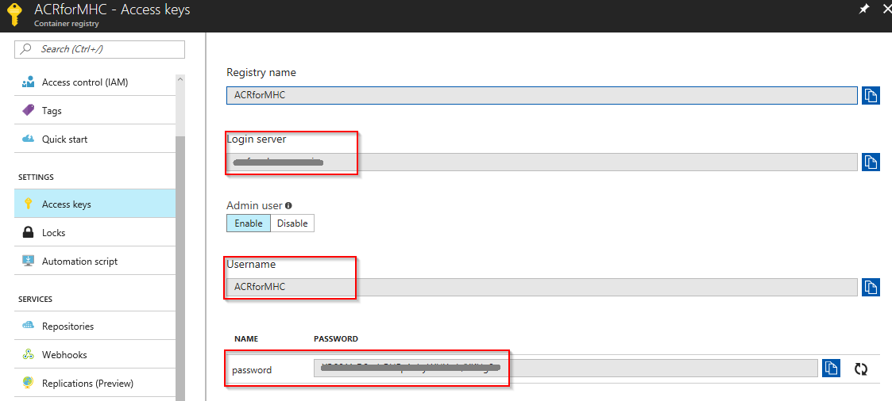

## Setting up the Project

1. Use <a href="https://vstsdemogenerator.azurewebsites.net" target="_blank">VSTS Demo Data Generator</a> to provision a project on your VSTS account 

2. Select **Docker AKS** for the template.
   

3. Once the project is provisioned, select the URL to navigate to the project that you provisioned.

   

## Exercise 1: Endpoint Creation

Since the connections are not established during project provisioning, we will manually create the endpoints. 

1. In VSTS, navigate to **Services** by clicking on the gear icon, and click on **+ New Service Endpoint**. Select **Azure Resource Manager**. Specify **Connection name**, select your **Subscription** from the dropdown and click **OK**. We use this endpoint to connect **VSTS** and **Azure**.

   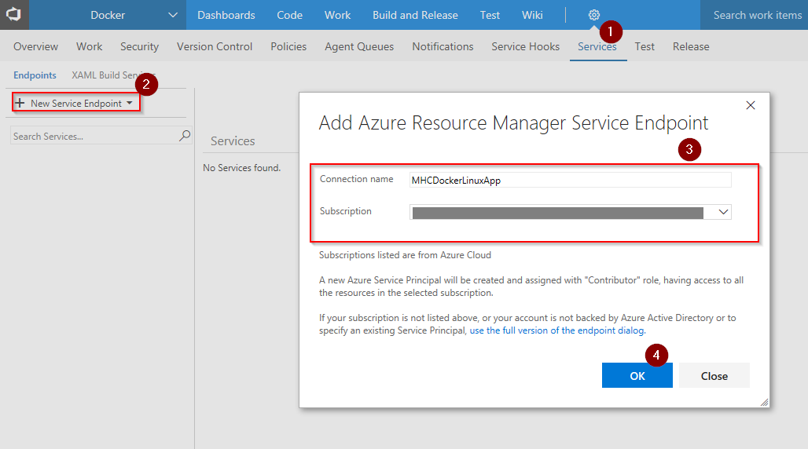

   You will be prompted to authorize this connection with Azure credentials. 

   **Note:** Disable pop-up blocker in your browser if you see a blank screen after clicking **OK**, and retry the step. 

2. Click **+ New Service Endpoint**, and select **Docker Registry** from the list. We use this endpoint to connect **VSTS** and **Azure Container Registry** (where images would be hosted).

   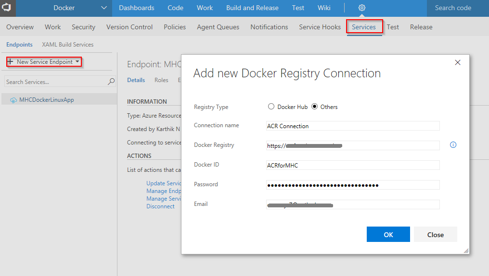

   For **Registry Type** select **Others**. Map the details to **Docker Registry Connection** from **Azure Container Registry** (in azure portal) with the parameters as shown:

    <table width="100%">
     <thead>
      <tr>
         <th width="50%"><b>Docker Registry Connection</b></th>
         <th><b>Azure Container Registry</b></th>
      </tr>
   </thead>
    <tr>
      <td>Docker Registry (starts with https://)</a></td>
      <td>Login server</td>
    </tr>
    <tr>
      <td>Docker ID</a> </td>
      <td>Username</td>
     </tr>
     <tr>
      <td>Password</b></a> </td>
      <td>Password </td>
     </tr>
     <tr>
      <td>Email</a> </td>
      <td>Email id of azure account</td>
     </tr>
   </table>

3. Click **+ New Service Endpoint** once again, and select **Kubernetes** from the list. We use this endpoint to connect **VSTS** and **Azure Container Service (AKS)**.

    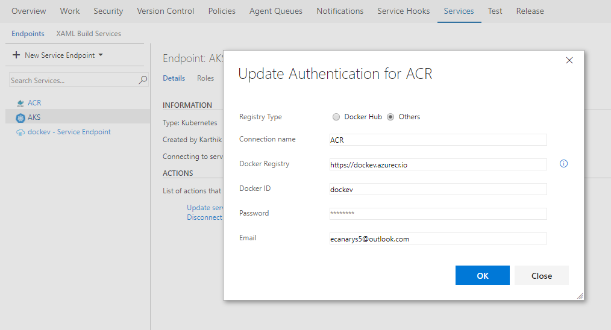

## Exercise 2: Configure CI-CD

 Now that connections are established, we will manually map the endpoints to build and release definitions.

1. Go to **Builds** under **Build and Release** tab, **Edit** the build definition **Docker**.

   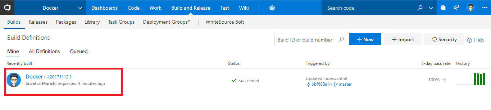

2. Click on **Process** section, select endpoint components from the dropdown under **Azure subscription** and **Azure Container Registry** as shown.

   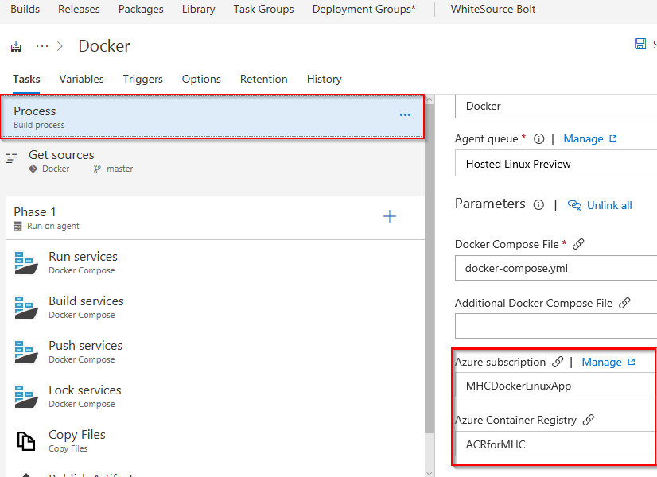

    

   <table width="100%">
   <thead>
      <tr>
         <th width="50%"><b>Tasks</b></th>
         <th><b>Usage</b></th>
      </tr>
   </thead>
   <tr>
      <td><a href="http://bit.ly/2zlTspl"><b>Run services</b></a> </td>
      <td>prepares suitable environment by restoring required packages</td>
   </tr>
   <tr>
      <td><a href="http://bit.ly/2zlTspl"><b>Build services</b></a> </td>
      <td>builds <b>service images</b> specified in a <b>docker-compose.yml</b> file with registry-qualified names and additional tags such as <b>$(Build.BuildId)</b></td>
   </tr>
    <tr>
      <td><a href="http://bit.ly/2zlTspl"><b>Push services</b></a> </td>
      <td>pushes <b>service images</b> specified in a <b>docker-compose.yml</b> file, with multiple tags, to container registry</td>
   </tr>
    <tr>
      <td><a href="http://bit.ly/2zlTspl"><b>Lock services</b></a> </td>
      <td>pulls image from default tag <b>latest</b> in container registry and verifies if uploaded image is up to date</td>
   </tr>
   <tr>
      <td><a href="http://bit.ly/2iDhjpO"><b>Copy Files</b></a>  </td>
      <td>used to copy files from source to destination folder using match patterns </td>
   </tr>
   <tr>
      <td><a href="http://bit.ly/2zGD6bn"><b>Publish Build Artifacts</b></a>  </td>
      <td> used to share the build artifacts </td>
   </tr>
   </table>

3. Click **Save**.

   

4. Go to **Releases** under **Build & Release** tab, edit the release definition **Docker** and select **Tasks**. Update the Azure Connection Type, Azure Subscription, and SQL DB Details such as Azure SQL Server Name, Database Name, Server Admin Login, Password.

   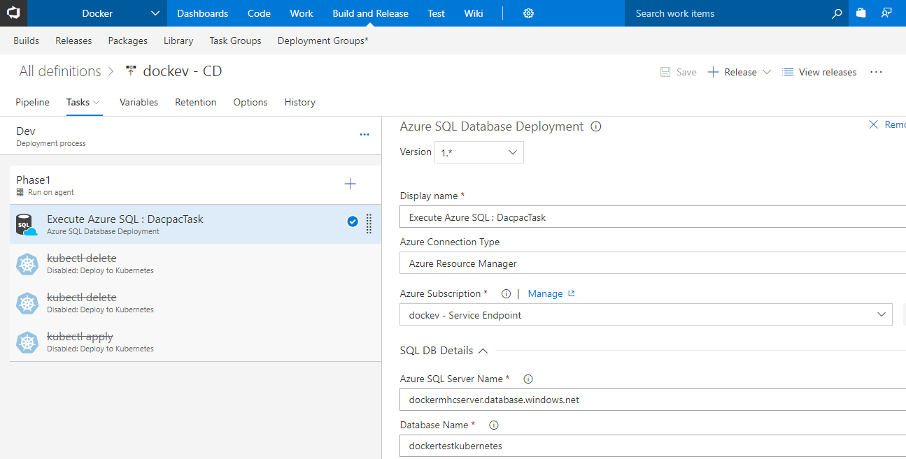

     

   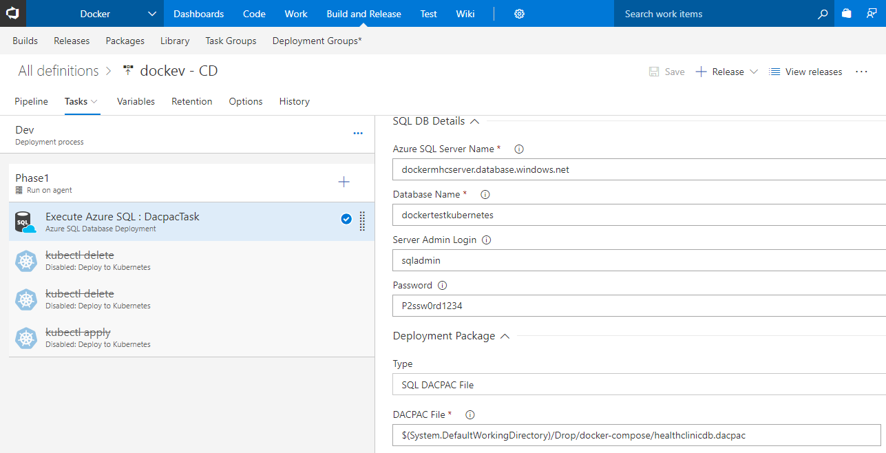

     

   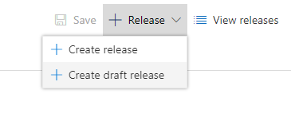

   After this step is complete, the database schema will be deployed to SQL Database. 

5. Right click on task **Execute Azure SQL : DacpacTask**, and click on **Disable Selected Task(s)**. After this, right click on each of **kubectl delete deployments**, **kubectl delete services** and **kubectl deploy** tasks, and select **Enable Selected Task(s)** as shown and click **Save**.

    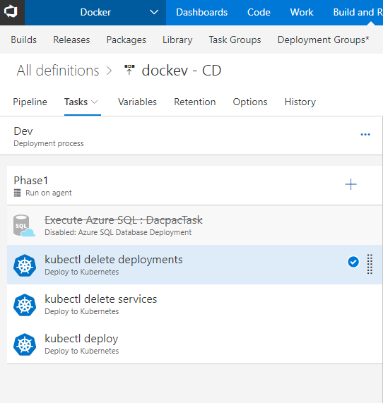

6. Under **each** of **kubectl delete deployments**, **kubectl delete services** and **kubectl deploy** tasks, update **Kubernetes Service Connection** and **Container Registry Details** such as Container Registry type, Azure subscription, Azure Container Registry from the dropdown. click **Save**.

   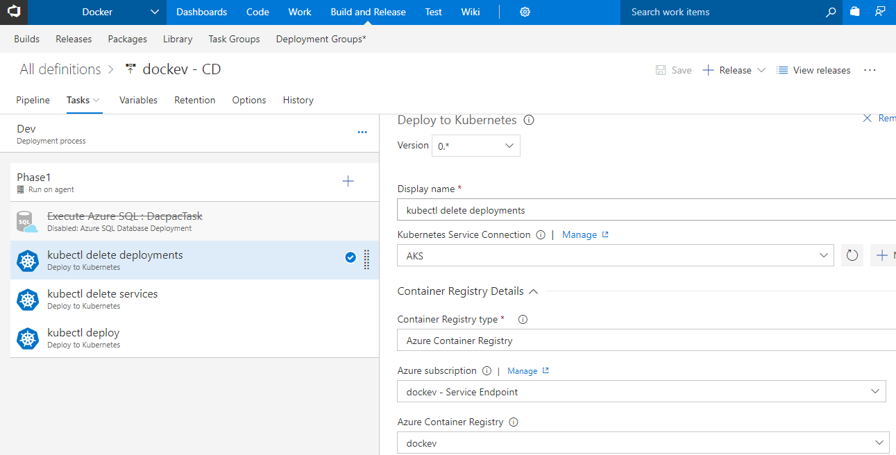

   Note: Repeat above step for all **three** Kubectl tasks.

**Kubectl tasks** will pull the latest image from repository specified, and deploys the image to Containers inside the Pods. 

## Exercise 3: Update Connection String

1. Click on **Code** tab, and navigate to **healthclinic.sql** file. Copy entire content of this file.

    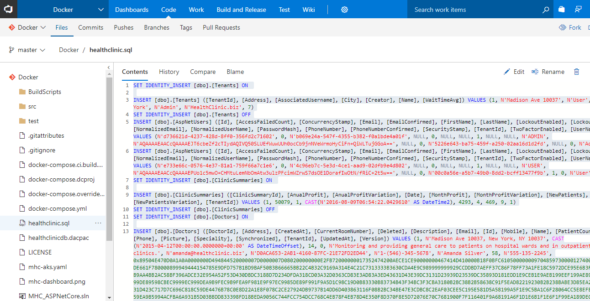   

2. Switch to Azure Portal, and navigate to the SQL Database which you created at the beginning of this lab.Click on **Data Explorer**, and provide database **Password** to login. 

    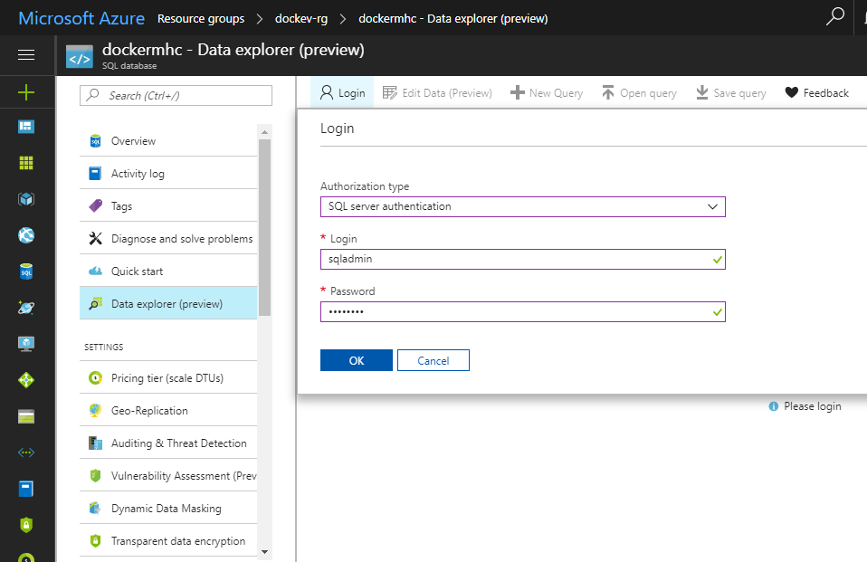   

3. Paste the content copied from **healthclinic.sql** file as shown, and click on **Run**. This will now push required data into the database.

    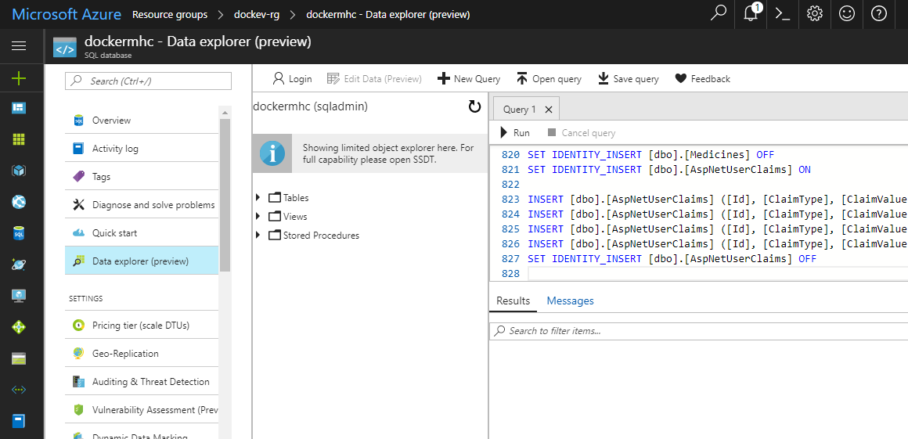 

4.  Scroll down on to **Connection Strings** section and copy the contents as shown.

    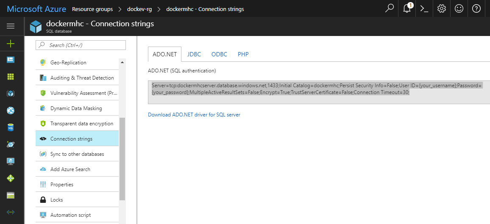 

5. Switch to your VSTS account. Go to **Code** tab, and navigate to the below path to edit the file- 

    >Docker/src/MyHealth.Web/appsettings.json

    Go to line number **9**. Paste the connection string as shown and manually update the **User ID** and **Password**. Click on **Commit**.

   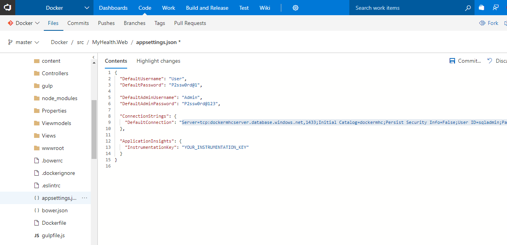

## Exercise 3: Add secret in AKS (Editing and images are pending)

1. To access Azure Container Registry from AKS, you need to create a secret. From commandline, use **az login** to access your azure account 

2. To connect to the Kubernetes cluster from your computer, use **kubectl**, the Kubernetes command-line client.

    For installing it locally, run the following command:

    >az aks install-cli

**Connect with kubectl:**

To configure kubectl to connect to your Kubernetes cluster, run the following command:

>az aks get-credentials --resource-group=myResourceGroup --name=myK8sCluster

>kubectl create secret docker-registry SECRET_NAME --docker-server=REGISTRY_NAME.azurecr.io --docker-username=USERNAME --docker-password=PASSWORD --docker-email=ANY_VALID_EMAIL

**Create a secret called as acrconnection**

Get the current configuration of the ServiceAccount

>kubectl get serviceaccounts default -o yaml > ./serviceaccount.yml

Add below line to the end of the **serviceaccount.yml** file:

>imagePullSecrets:  
-name: acrconnection

Replace the current configuration of the ServiceAccount with this new one:
>kubectl replace serviceaccount default -f ./serviceaccount.yml

Now when we deploy images located in our Azure Container Registry, the images can be pulled by Kubernetes.

**To access AKS through browser:**

>az aks browse --resource-group AKS-RG1 --name aks

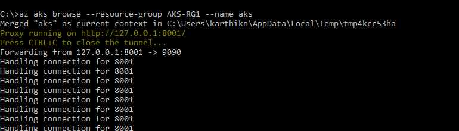

 

**AKS Dashboard:**

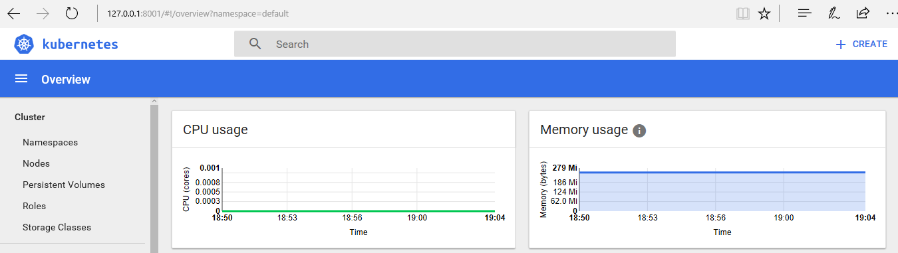

## Exercise 4: Code update

We will update the code to trigger CI-CD. As per instructions mentioned in **mhc-aks.yml** file the required Pods and Services are created in AKS. Our application is deployed behind a loadbalancer with the Redis cache.

1. Go to **Code** tab, and navigate to the below path to edit the file- 

   >Docker/src/MyHealth.Web/Views/Home/**Index.cshtml**

   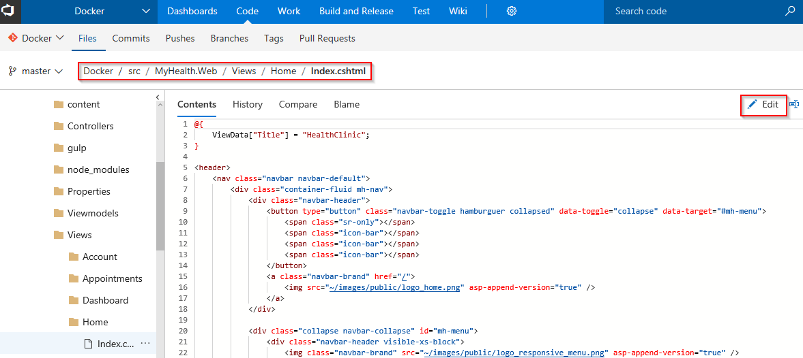

2. Go to line number **28**, update **JOIN US** to **JOIN US!!!**, and click **Commit**.

    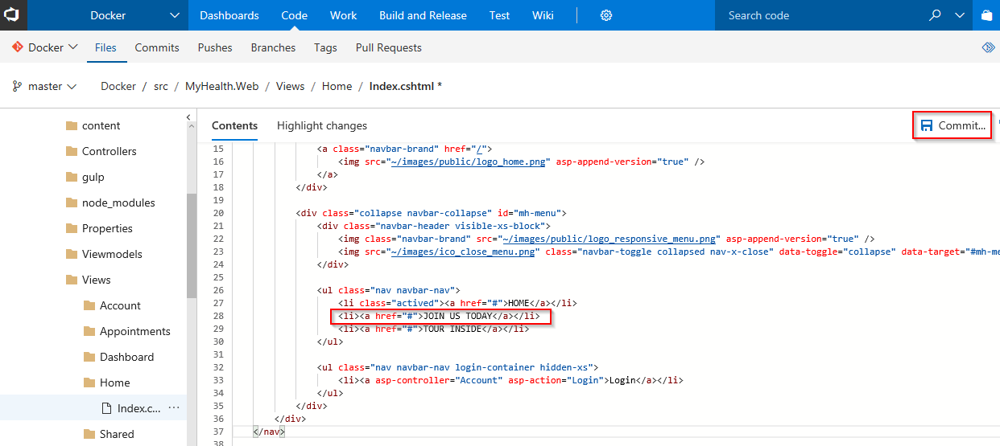

3. Go to **Builds** tab to see the CI build in progress.

    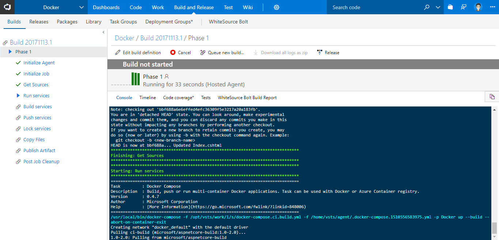

4. The build will generate and push the image to ACR. After build completes, you will see the build summary. 
    
    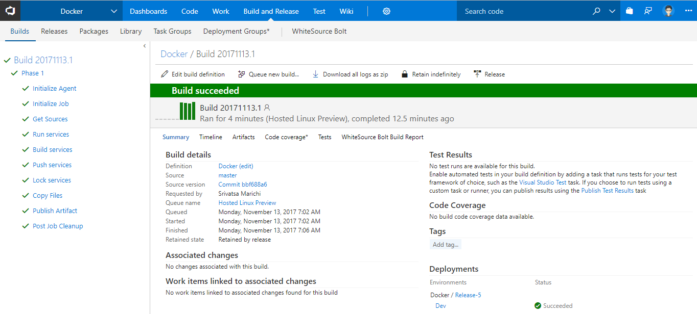
   

5. Go to **Releases** tab to see the release summary.

    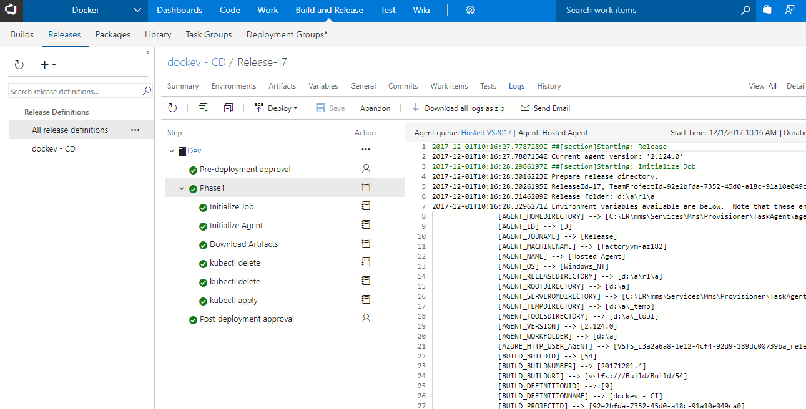

6. Go to commandline and run below command to see the pods:

    >kubectl get pods

    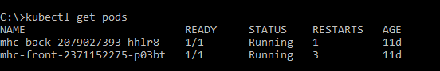

      

8. To get the IP address, run below command. If you see that External-IP is pending, wait for a while until an IP is assigned.

    >kubectl get service azure-vote-front --watch

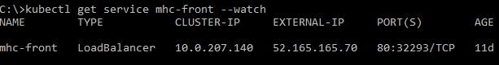
 
9. Copy External-IP and paste it in your browser.

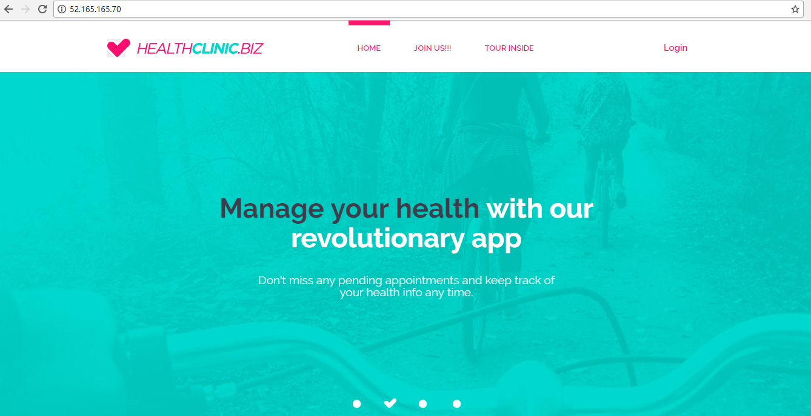

8. To see the generated images in Azure Portal, go to **Azure Container Registry** and navigate to **Repositories**.

    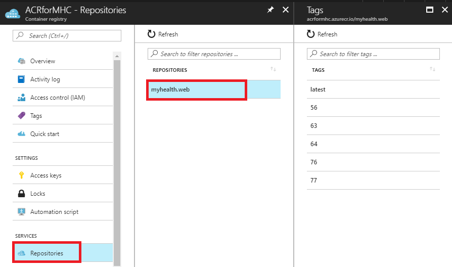

## Summary

With **Visual Studio Team Services** and **Azure Container Services (AKS)**, we can build DevOps for dockerized applications.

## Feedback

